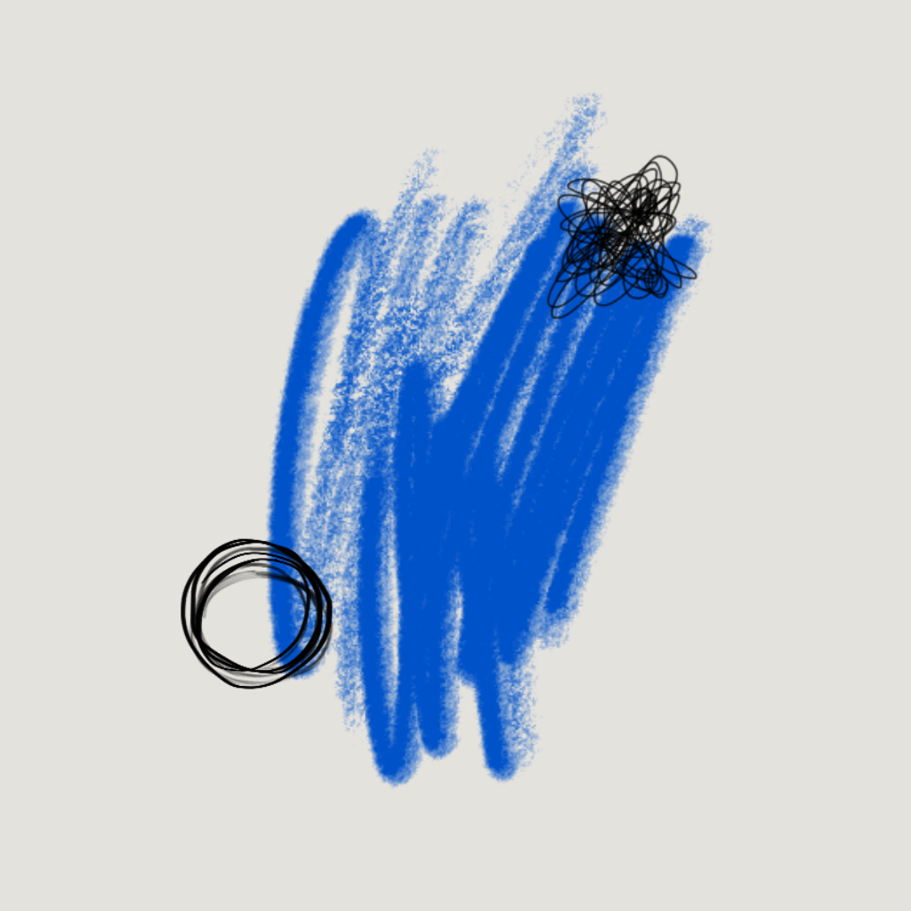

<p align="center">
  
</p>

<h1 align="center">vault-mcp</h1>

<p align="center">
  <a href="https://github.com/videnovnebojsa/vault-mcp/actions/workflows/ci.yml"></a>
  <a href="LICENSE"></a>
  <a href="https://bun.sh"></a>
</p>

<p align="center">MCP server that gives your agent direct, always-on access to your Obsidian vault — no plugin, no Obsidian process required.</p>

## Why vault-mcp?

**It works whether Obsidian is running or not** — reads the vault directly from the filesystem.

**Most vault tools serve one client at a time.** vault-mcp runs an always-on HTTP server, so Claude Code and Claude Desktop can both connect to the same vault index simultaneously.

**Keyword-only search misses concepts. Pure semantic search misses exact terms.** vault-mcp fuses FTS5 keyword ranking with vector embeddings into a single hybrid query, tunable per call.

## Demo


## Features

**Search**
- Hybrid FTS5 + vector embeddings with tunable alpha blend
- Tag, type, and date filters; paginated results
- Semantic connection finder — surfaces related notes that aren't linked to each other

**Vault operations**
- Read note, read section, read note with all its linked notes in one call
- Write, update frontmatter, move (with automatic `[[wikilink]]` rewrite across the vault), soft-delete to `.trash/`
- Batch operations — move/delete/update multiple notes in one call

**Knowledge workflows**
- Capture pipeline — classify and file free-form text into the right folder
- Inbox triage — auto-classify and move notes above a confidence threshold
- Periodic notes — open or create daily, weekly, and monthly notes

**Infrastructure**
- Multi-vault — name and switch between multiple vaults in the same server instance
- stdio bridge — connect Claude Desktop to the always-on HTTP server
- Automatic SQLite backup with configurable retention
- OpenTelemetry spans per tool call; webhook alert notifications
- `/health` and `/ready` endpoints for service probes

## Example Prompts

Tell your agent what you need — vault-mcp picks the right tool automatically:

- "Search my vault for notes on distributed tracing"
- "Capture this idea: use SQLite WAL mode for concurrent readers"
- "Open today's daily note"
- "Find notes similar to Projects/architecture-rfc but not linked to it"
- "Show me the Decision section of Projects/db-schema"
- "Triage my inbox — auto-move anything above 80% confidence"
- "What tags do I use most in my vault?"
- "Rebuild the search index"

See [docs/prompts.md](docs/prompts.md) for the full prompt guide covering all 18 tools.

---

## Quick Start

### Option 1 — Quick install (no Bun required)

Downloads the pre-built binary for your platform, walks you through configuration, and optionally installs a background service.

```bash
# macOS / Linux
curl -fsSL https://raw.githubusercontent.com/videnovnebojsa/vault-mcp/main/install.sh | sh

# Windows (PowerShell)
irm https://raw.githubusercontent.com/videnovnebojsa/vault-mcp/main/install.ps1 | iex
```

To reconfigure after install (change vault path, port, etc.):

```bash
bash install.sh --configure    # macOS / Linux
.\install.ps1 -Configure       # Windows
```

### Option 2 — Developer install (build from source)

Requires [Bun](https://bun.sh) 1.3+.

```bash
git clone https://github.com/videnovnebojsa/vault-mcp
cd vault-mcp
bun install
bun run setup
```

The setup script builds the binary, walks you through configuration, and installs a background service that starts automatically at login — **launchd** on macOS, **systemd** on Linux, **Task Scheduler** on Windows.

### Connect Claude Code

Add to `.mcp.json` in your project root:

```json
{
  "mcpServers": {
    "vault": { "type": "http", "url": "http://127.0.0.1:3782/mcp" }
  }
}
```

### Connect Claude Desktop

Add to `claude_desktop_config.json`:

```json
{
  "mcpServers": {
    "vault": {
      "command": "bun",
      "args": ["/path/to/vault-mcp/bin/stdio-bridge.ts"],
      "env": { "VAULT_MCP_URL": "http://127.0.0.1:3782/mcp" }
    }
  }
}
```

### Verify

```bash
curl http://localhost:3782/health
# {"status":"ok","uptimeSeconds":12,...}
```

`/ready` returns HTTP 503 until the vault index finishes its initial sync; `/health` always returns 200.

## Configuration

All settings live in `~/.config/vault-mcp/.env`. The setup script writes this file with your answers and leaves every optional variable commented out with its default; if you install manually, start from [.env.example](.env.example).

To update settings interactively after installation, run:

```bash
bun run configure
```

This opens a section menu, prompts for each setting with validation, shows a diff of what will change, and optionally restarts the service. Jump straight to a section with `--section <id>`:

```bash
bun run configure -- --section embeddings
```

**Custom folder structure?** vault-mcp defaults to a numbered Zettelkasten-style layout. Run `bun run configure -- --section vault-folders` to remap the capture pipeline to your own folder names.

To edit the file manually instead, open `~/.config/vault-mcp/.env` and restart the service when done:

| Platform | Command |
|---|---|
| macOS | `launchctl kickstart -k gui/$UID/com.vault-mcp` |
| Linux | `systemctl --user restart vault-mcp` |
| Windows | `schtasks /End /TN vault-mcp && schtasks /Run /TN vault-mcp` |

## Development

```bash
bun run test                      # run test suite
bun run build                     # compile TypeScript → dist/
bun run build:bun                 # Binary build scripts → dist-bin/ (standalone executable)
bun run scripts/smoke-test.ts     # smoke test the built binary against a real vault
bun run lint                      # biome check
```

## Documentation

| Topic | Link |
|---|---|
| Installation options (manual, service) | [docs/installation.md](docs/installation.md) |
| Connecting MCP clients | [docs/clients.md](docs/clients.md) |
| Full configuration reference | [docs/configuration.md](docs/configuration.md) |
| Full tool reference | [docs/tools.md](docs/tools.md) |
| Feature roadmap & status | [docs/roadmap.md](docs/roadmap.md) |

### Contributing

| Topic | Link |
|---|---|
| Internal module map & data flow | [docs/contributing/architecture.md](docs/contributing/architecture.md) |
| Architectural rules & patterns | [docs/contributing/design-standards.md](docs/contributing/design-standards.md) |
| Tooling, lint, test, CI standards | [docs/contributing/typescript-standards.md](docs/contributing/typescript-standards.md) |

## License

[MIT](LICENSE)
